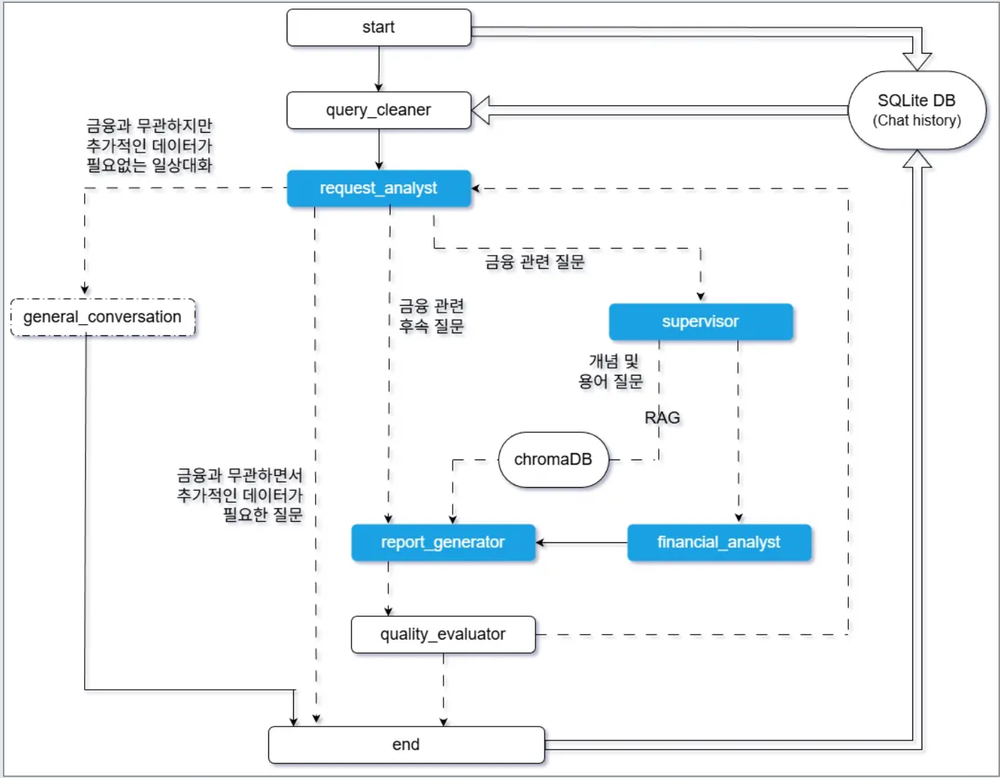
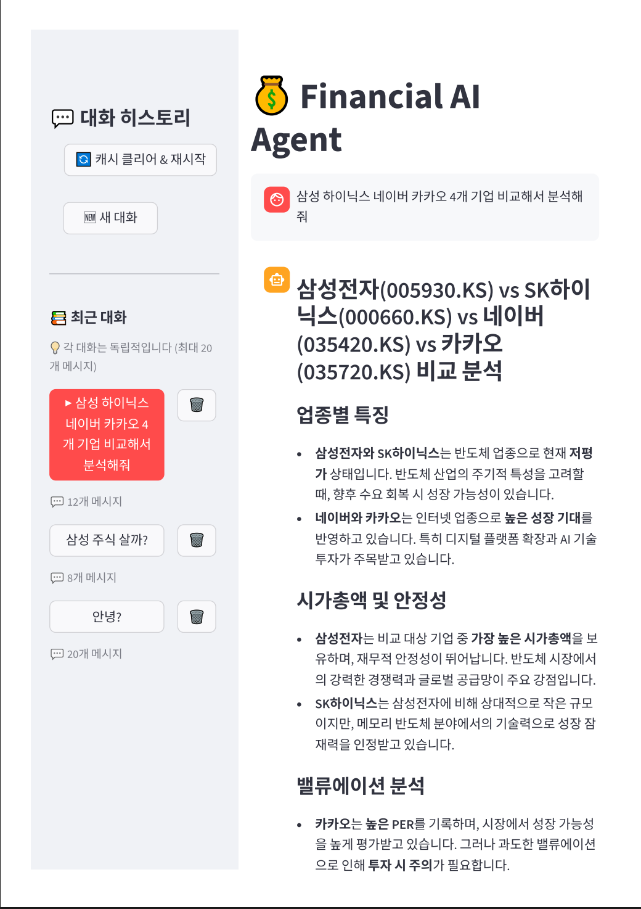
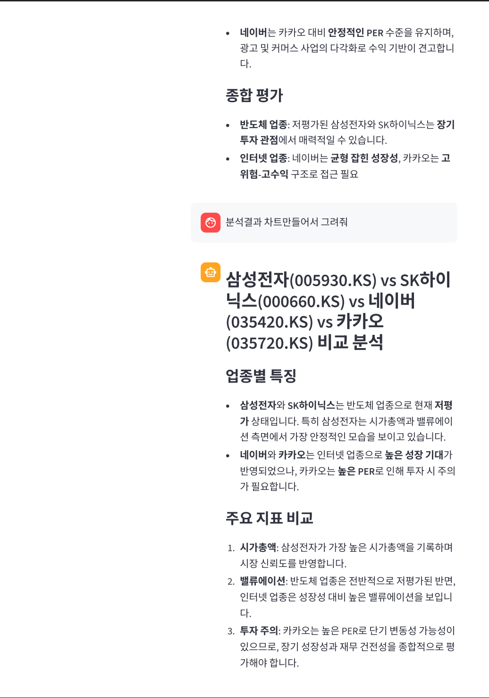
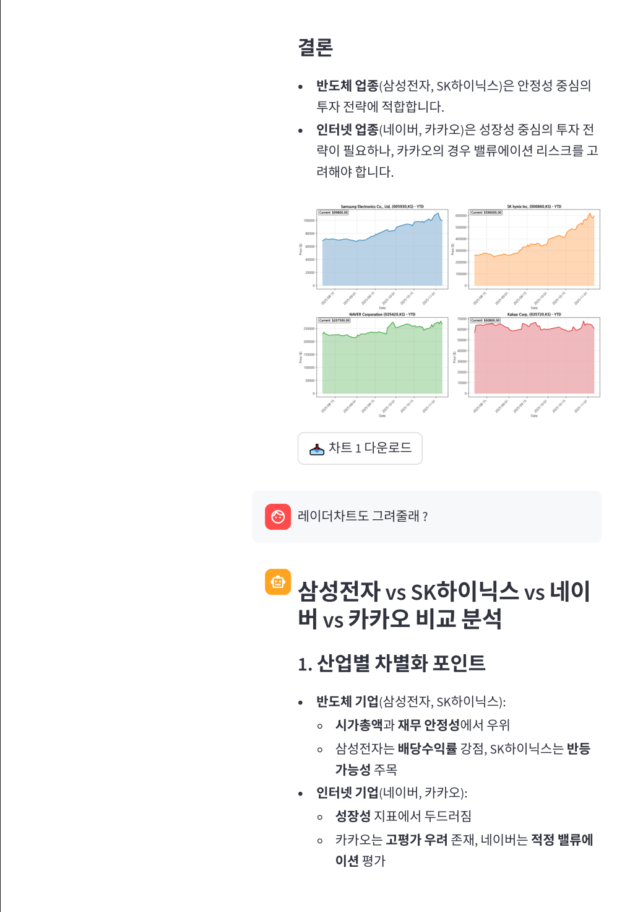
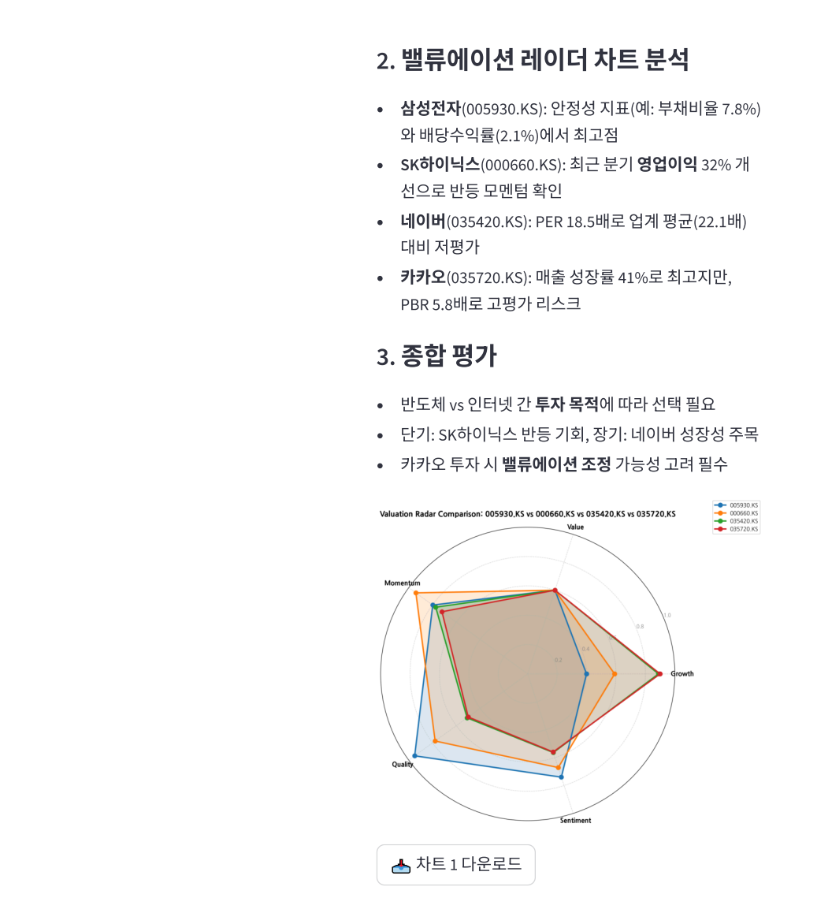

# **금융 AI 에이전트 프로젝트**

LangChain/LangGraph 기반의 멀티 에이전트 시스템으로, 금융 도메인 Q&A, 주식 분석, RAG 기반 용어 검색을 지원합니다.

- **프로젝트 기간:** 2025.10.28 ~ 2025.11.06  

---

## Requirements (uv 사용)

```bash
#  의존성 설치
#  1) pyproject.toml 기반 설치
uv sync

#  2) 또는 requirements.txt 기반 설치
uv pip install -r requirements.txt
```

## 디렉토리 구조

```bash
.
├── README.md                                          # 프로젝트 소개 및 사용 가이드
├── charts/                                            # 생성된 차트 이미지 저장 (PNG)
├── data/
│   ├── chroma_store/                                  # ChromaDB 벡터 DB (RAG 검색용)
│   │   ├── chroma.sqlite3
│   │   └── fb4a4e41-4dd8-46dc-86e8-b1dfd5224522/
│   └── pdf/                                           # RAG 데이터 소스 PDF 문서
│       ├── 2020_경제금융용어 700선_한국은행.pdf
│       ├── 주식용어모음집.pdf
│       └── 주식용어정리.pdf
│
├── database/
│   └── chat.db                                        # 대화 히스토리 DB
│
├── fonts/                                             # PDF 생성용 한글 폰트
│   ├── NanumGothic.ttf
│   └── NanumGothicBold.ttf
│
├── img/                                               # 문서 이미지 및 다이어그램
│   ├── ai_agent_project_architecture_team1.png        # 기존 아키텍처 다이어그램
│   ├── code.png                                       # 코드 스크린샷
│   └── workflow_diagram.mmd                           # Mermaid 워크플로우 다이어그램
│
├── logs/                                              # 애플리케이션 로그
│   ├── app_{date}.log                                 # 일반 로그 (INFO, DEBUG)
│   └── error_{date}.log                               # 에러 로그 (ERROR, CRITICAL)
│
├── reports/                                           # 생성된 보고서 파일 (PDF/MD/TXT)
│
├── src/
│   ├── main.py                                        # CLI 엔트리포인트 (디버깅 용도)
│   ├── streamlit_app.py                               # Streamlit 웹 UI (서빙 용도)
│   │
│   ├── agents/                                        # AI 에이전트 모듈
│   │   ├── financial_analyst.py                       # 금융 데이터 수집 및 분석
│   │   ├── query_cleaner.py                           # 쿼리 오타 수정 및 정제
│   │   ├── report_generator.py                        # 보고서 생성 및 차트/파일 생성
│   │   ├── request_analyst.py                         # 요청 분류 및 라우팅
│   │   ├── supervisor.py                              # 에이전트 라우팅 결정
│   │   └── tools/                                     # 에이전트 도구
│   │       ├── financial_tools.py                     # 금융 데이터 수집 및 분석 도구 (5개)
│   │       └── report_tools.py                        # 보고서 생성 및 차트/파일 생성 도구 (3개)
│   │
│   ├── database/                                      # 데이터베이스 모듈
│   │   └── chat_history.py                            # SQLite 대화 히스토리 관리
│   │
│   ├── evaluator/                                     # 품질 평가 모듈
│   │   └── llm_quality_evaluator.py                   # LLM Judge 기반 품질 평가
│   │
│   ├── model/
│   │   └── llm.py                                     # 프롬프트 및 LLM 모델 관리
│   │
│   ├── rag/                                           # RAG 모듈 (금융 용어/개념 검색)
│   │   ├── retriever.py                               # 벡터 검색 및 문서 검색
│   │   └── vector_store.py                            # ChromaDB 벡터 스토어
│   │
│   ├── utils/                                         # 유틸리티 모듈
│   │   ├── config.py                                  # 환경변수 및 설정 관리
│   │   ├── logger.py                                  # 로깅 설정
│   │   └── workflow_helpers.py                        # 워크플로우 헬퍼 함수
│   │
│   ├── web_test/                                      # Stramlit 테스트
│   │   └── streamlit_demo.py                          # Streamlit 데모 페이지
│   │
│   └── workflow/
│       └── workflow.py                                # LangGraph 워크플로우
│
├── render.yaml                                        # Render.com 배포 설정
├── requirements.txt                                   # pip 의존성 목록
└── pyproject.toml                                     # uv 기반 프로젝트 설정
```

## **1. 서비스 구성 요소**

### **1.1 주요 기능**

1. **질의 정제 (Query Cleaning)**: 사용자 입력의 오타 수정, 문맥 기반 의도 명확화, 후속 질문 감지

2. **금융 관련성 분류**: 사용자 질문이 경제/금융 관련인지 판별, 비금융 질문 필터링

3. **스마트 라우팅**: `supervisor`가 질문 성격에 따라 `RAG`(용어/정의 중심) 또는 `financial_analyst`(종목 분석/비교)로 자동 라우팅

4. **주식 분석/비교**:
   - 종목 티커 자동 추출 (회사명 → 티커 검색)
   - yfinance 기반 실시간 주식 정보 수집 (가격, 재무 지표, 뉴스 등)
   - 단일 종목 분석 및 다중 종목 비교 분석
   - 웹 검색을 통한 최신 뉴스/분석 수집
   - 애널리스트 추천 조회

5. **RAG 검색**: `data/pdf` 문서를 임베딩하여 ChromaDB에 저장, LangChain Retriever 로 신뢰 가능한 근거 기반 답변 제공

6. **보고서 생성**:
   - 마크다운 형식의 상세 분석 보고서 작성
   - 주가 차트 생성 (matplotlib)
   - 밸류에이션 레이더 차트 생성 (다중 종목 비교 시)
   - 보고서를 MD/PDF/TXT 형식으로 저장 (`reports/` 디렉토리)
7. **품질 평가 & 자동 재시도**: LLM-as-a-judge로 답변의 정확성/완전성/관련성/명확성을 평가, 불합격 시 질의 재작성 후 자동 재시도

8. **대화 히스토리 관리**: 세션별 대화 기록 저장(SQLite), 이전 대화 맥락 참조

9. **일반 대화 처리**: 인사, 감사, 메타 질문 등 비금융 대화 처리

10. **웹/CLI 인터페이스**: Streamlit 기반 웹 UI 및 CLI 인터페이스 제공

### **1.2 사용자 흐름**

1. **질문 입력** → 사용자가 Streamlit UI 또는 CLI에서 질문 입력

2. **질의 정제** → 문맥 기반 오타 수정 및 의도 명확화

3. **금융 여부 판별** → `request_analyst`가 금융 관련 질문 여부 확인

4. **라우팅** → `supervisor`가 RAG vs 주식 분석으로 분기 결정

5. **데이터 수집/분석**:
   - RAG 경로: ChromaDB에서 관련 문서 검색
   - 주식 분석 경로: yfinance/웹 검색으로 실시간 데이터 수집 후 분석

6. **보고서 생성** → 분석 결과를 마크다운 보고서로 변환, 필요시 차트 생성 및 파일 저장

7. **품질 평가** → LLM이 답변 품질 평가, 불합격 시 재시도

8. **결과 반환** → 생성된 보고서, 차트 경로, 저장된 파일 경로를 사용자에게 제공

---

## **2. 개발환경 및 협업 툴**

### **2.1 Environments**

- **개발 환경:** Python 3.10+, Ubuntu 20.04.6 LTS
- **테스트 환경:** 로컬 개발 환경

### **2.2 협업 툴**

- **소스 관리:** [GitHub](https://github.com/AIBootcamp14/langchainproject-new-langchainproject_1)
- **프로젝트 관리:** [Notion](https://www.notion.so/_1-29640cb3731d80a19382f147704be42d)
- **커뮤니케이션:** Slack
- **패키지 관리:** uv

---

## **3. 최종 선정 AI 모델 구조**

- **LLM 모델**: Upstage Solar-Pro2
- **임베딩 모델**: BAAI/bge-m3 (HuggingFace)
- **구조**: LangGraph 기반 State Machine, 멀티 에이전트 아키텍처
- **학습 데이터**:
  - RAG: 금융 용어집 PDF 문서 (한국은행 등)
  - 실시간 데이터: yfinance API, Tavily 웹 검색 API
- **평가 지표**: LLM-as-a-judge 기반 품질 평가 (정확성, 완전성, 관련성, 명확성 1-5점 척도)

---

## **4. 서비스 아키텍처**

### **4.1 시스템 구조도**

서비스 아키텍처 다이어그램을 첨부합니다.



### **4.2 데이터 흐름도**

```
사용자 질문
    ↓
[Query Cleaner] → 오타 수정, 의도 명확화
    ↓
[Request Analyst] → 금융 관련 여부 판별
    ↓
[Supervisor] → 라우팅 결정
    ├─→ [RAG Path] → [Retriever] → ChromaDB 검색 → [Report Generator]
    └─→ [Financial Analyst] → yfinance/웹 검색 → 분석 데이터 → [Report Generator]
    ↓
[Report Generator] → 보고서 생성, 차트 생성, 파일 저장
    ↓
[Quality Evaluator] → 품질 평가
    ├─ 합격 → 최종 답변 반환
    └─ 불합격 → 질의 재작성 → 재시도 (최대 2회)
```

---

## **5. 사용 기술 스택**

### **5.1 백엔드 & 프레임워크**

- **프레임워크**: LangChain, LangGraph, Streamlit
- **LLM**: Upstage ChatUpstage (Solar-Pro2)
- **데이터베이스**: SQLite (대화 히스토리), ChromaDB (벡터 저장소)
- **패키지 관리**: uv

### **5.2 RAG & 데이터**

- **벡터 DB**: ChromaDB
- **임베딩**: HuggingFace Embeddings (BAAI/bge-m3)
- **문서 처리**: PyPDFLoader, RecursiveCharacterTextSplitter
- **금융 데이터**: yfinance, Tavily 검색 API

### **5.3 데이터 시각화 & 보고서**

- **차트**: matplotlib, pandas
- **보고서 생성**: ReportLab (PDF), Markdown

### **5.4 배포 및 운영**

- **배포 플랫폼**: Render.com (render.yaml)
- **로깅**: Python logging (파일/콘솔)
- **환경 변수**: python-dotenv

---

## **6. 팀원 소개**

| 이름      | 역할              | GitHub                               | 담당 기능                                 |
|----------|------------------|-------------------------------------|-----------------------------------------|
| **김장원** | 팀장 | [GitHub 링크](https://github.com/jkim1209)             | 아키텍처 디자인 및 관리, 에이전트 및 도구 개발, 모듈 통합 및 배포|
| **김수환** | 팀원 | [GitHub 링크](https://github.com/suhwankimkim)             | 데모 streamlit 앱 개발, 에이전트 개발, 디버깅 및 리팩토링|
| **이윤서** | 팀원 | [GitHub 링크](https://github.com/riicoseo)             | RAG 시스템 개발, LangGraph Workflow 개발|
| **이가은** | 팀원 | [GitHub 링크](https://github.com/kkaeunii)             | 에이전트 개발, 프롬프팅|
| **이건희** | 팀원 | [GitHub 링크](https://github.com/GH-Lee33)             | 도구 개발|

---

## **7. Appendix**

### **7.1 참고 자료**

- **LangChain**: <https://python.langchain.com/>
- **LangGraph**: <https://langchain-ai.github.io/langgraph/>
- **Upstage API**: <https://developers.upstage.ai/>
- **yfinance**: <https://pypi.org/project/yfinance/>
- **ChromaDB**: <https://www.trychroma.com/>

### **7.2 설치 및 실행 방법 (uv)**

1. **필수 라이브러리 설치:**

    ```bash
    # 1) pyproject.toml 기반 설치치
    uv sync

    # 2) 혹은 requirements.txt 를 사용한 설치
    uv pip install -r requirements.txt
    ```

2. **환경변수 설정 (`.env` 파일 생성):**

    ```bash
    # 필수 API 키
    OPENAI_API_KEY="YOUR_OPENAI_API_KEY"
    UPSTAGE_API_KEY="YOUR_UPSTAGE_API_KEY"
    TAVILY_API_KEY="YOUR_TAVILY_API_KEY"
    
    # 선택: 허깅페이스 토큰 (임베딩 모델 다운로드 필요 시)
    HF_TOKEN="YOUR_HF_TOKEN"
    
    # 아래 값들은 코드 내 기본값으로 동작하므로 .env 생략 가능
    # EMBEDDING_MODEL=BAAI/bge-m3
    # PERSIST_DIR=data/chroma_store
    # PDF_PATH_PATTERN=data/pdf/*.pdf
    # COLLECTION_NAME=finance_terms
    ```

3. **RAG 인덱스 구성 (선택):**

    ```bash
    uv run python -m src.rag.vector_store
    ```

4. **웹 앱 실행 (Streamlit):**

    ```bash
    uv run streamlit run src/streamlit_app.py
    ```

5. **CLI 버전 실행:**

    ```bash
    uv run python src/main.py
    ```

6. **웹페이지 접속 (Streamlit):**

    ```txt
    http://localhost:8501
    ```

---

## **8. 사용 예시**

### 시연 화면

<br>
<br>
<br>


### 질문 예시

- "애플 주식 분석해줘"
- "삼성전자와 애플을 비교해줘"
- "레버리지 ETF란 뭐야?" (RAG 검색)
- "애플 주식 분석 보고서를 차트와 함께 PDF로 저장해줘"
- "나스닥이 뭐야?" (RAG 검색)

### 응답 형태

- 마크다운 형식의 상세 분석 보고서
- 주가 차트 이미지 (`charts/` 디렉토리)
- 저장된 파일 경로 (`reports/` 디렉토리)
